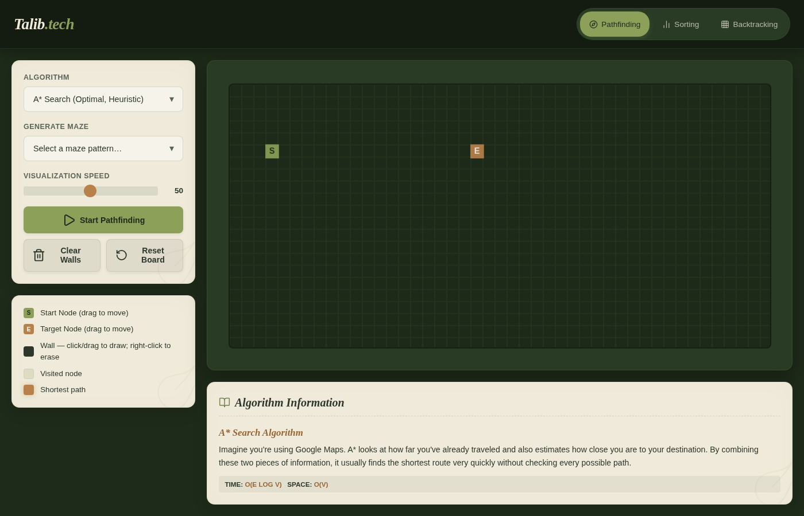
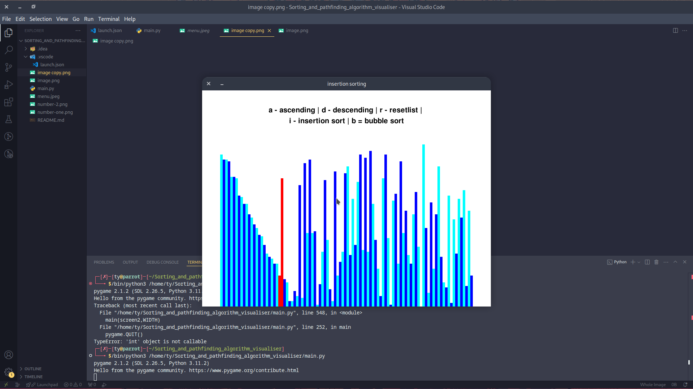
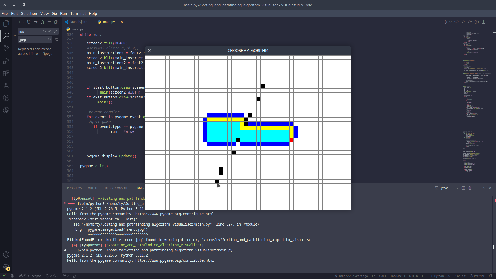

# Algorithm Visualizer

A hands-on visualizer for pathfinding, sorting, and backtracking algorithms — built because reading about algorithms in a textbook never really clicked for me. Watching A* hunt down a path through a maze or seeing Merge Sort tear apart and reassemble an array in real time just *makes it stick*.

There are two versions: the original **Python/Pygame** desktop app, and a newer **web version** that runs in any browser.

---

## Web Version



### What's inside

**Pathfinding** — draw walls on a grid, drag the start and end points wherever you want, then watch the algorithm explore. You can also generate a maze and let it find a way through.

| Algorithm | What makes it interesting |
|---|---|
| A* | Uses a heuristic to aim toward the goal — usually the fastest |
| Dijkstra | Exhaustive and guaranteed shortest path, no shortcuts |
| BFS | Explores outward like ripples in water — always finds shortest on uniform grids |
| DFS | Dives deep first — may find *a* path, but not the shortest |

**Sorting** — a random array of bars gets shuffled and you pick the algorithm. The bars light up as comparisons and swaps happen so you can follow along.

| Algorithm | Best for seeing |
|---|---|
| Bubble Sort | How slow O(N²) really looks |
| Insertion Sort | Building a sorted section card by card |
| Selection Sort | The "find the minimum, place it" pattern |
| Quick Sort | Divide and conquer in action |
| Merge Sort | Breaking apart and merging back together |

**Backtracking** — the N-Queens solver places queens one by one on a chessboard, backtracks when it gets stuck, and keeps trying until every queen is safe.

### Running it locally

Just open `web_version/index.html` directly in your browser. No build step, no dependencies.

```bash
# Or serve it with Python for cleaner local dev
python3 -m http.server 8080 --directory web_version/
```

Then go to `http://localhost:8080`.

### Running with Docker / Podman

The web version comes with a `Dockerfile` that uses Nginx to serve the static files.

```bash
cd web_version/

# Build the image
docker build -t localhost/algo-visualiser .

# Run it (available at http://localhost:8080)
docker run -d -p 8080:80 --name algo-visualiser localhost/algo-visualiser
```

> **Using Podman?** It works the same — Podman emulates the Docker CLI. The `FROM` line in the Dockerfile already uses a fully-qualified image name (`docker.io/library/nginx:alpine`) so you won't hit the short-name resolution error.

To stop and clean up:

```bash
docker stop algo-visualiser
docker rm algo-visualiser
```

---

## Python Version (Original)

The original version is a desktop app built with Pygame. It was the first version I built while learning about graphs and data structures.

### Requirements

```bash
pip install pygame
```

### Running it

```bash
python main.py
```

### Screenshots




---

## Why I built this

I made this to help myself understand algorithms while studying data structures. There's something about *seeing* the visited nodes spread outward, or watching bars swap positions, that makes the theory finally feel real. If you're studying the same stuff, hopefully it helps you too.

Feel free to fork it, break things, and add your own algorithms.
